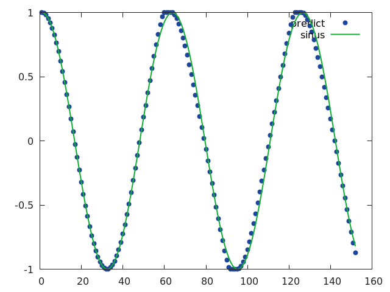

# Predict next values of sin with LSTM and Grid-LSTM


## LSTM



```bash
th train.lua -h
```

More details in my [blog post](http://christopher5106.github.io/deep/learning/2016/07/14/element-research-torch-rnn-tutorial.html)

You can get my model [here](https://s3-eu-west-1.amazonaws.com/christopherbourez/public/torch_sin/model_1500.t7)


## Grid LSTM

Requires [pull request](https://github.com/Element-Research/rnn/pull/345).

```bash
th train.lua -h -model=grid-lstm
```

## Hyperparameter tuning

```bash
th train.lua -h -hypertuning=true
```
